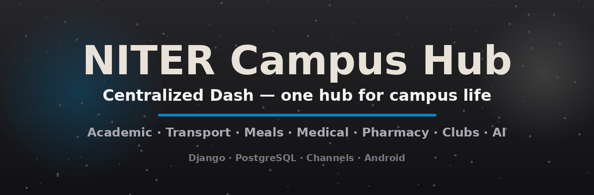

<div align="center">

# 🎓 NITER Campus Hub

### Centralized Dash — one hub for campus life

*Academic · Transport · Meals · Medical · Pharmacy · Clubs · AI*



[](https://www.python.org/)
[](https://www.djangoproject.com/)
[](https://www.postgresql.org/)
[](https://channels.readthedocs.io/)
[](mobile-webview/)
[](LICENSE)

**CampusDash is a web-based campus dashboard — a single Student Hub where every student can access the tools they need for daily campus life.** Instead of jumping between notice groups, paper tickets, phone calls, and scattered files, everything lives in one place.

</div>

---

## 📑 Table of Contents

- [What is Centralized Dash?](#-what-is-centralized-dash)
- [The Problem](#-the-problem)
- [The Solution](#-the-solution)
- [Core Features](#-core-features)
- [Role-Based Architecture](#-role-based-architecture)
- [Technology Stack](#-technology-stack)
- [Getting Started](#-getting-started)
- [Demo Accounts](#-demo-accounts)
- [Project Structure](#-project-structure)
- [Mobile App](#-mobile-app)
- [API & Realtime](#-api--realtime)
- [Security](#-security)
- [Roadmap](#-roadmap)
- [Documentation](#-documentation)
- [License](#-license)

---

## 🏛 What is Centralized Dash?

**CampusDash** is a modular, centralized digital hub designed to connect administrators with students, teachers, employees, and staff while bringing essential organizational services into **one secure ecosystem**.

It combines a centralized AI assistant, academic tools, health booking, transport & meal ticketing, official notices, and full club management into one practical platform designed for real use at NITER.

---

## 🚨 The Problem

Managing daily operations, academic activities, research, and communication across large organizations is often **fragmented, insecure, and inefficient**:

- Essential services (schedules, attendance, transport, meals, medical, clubs, notices) live in **separate apps, group chats, cloud drives, or paper**
- Students and staff must **switch between multiple platforms** to access essential services
- Administrative teams have **limited centralized visibility** over daily operations
- Manual booking and record-keeping **increase workload and errors**
- Important notices and emergency information are **hard to distribute quickly**
- Broad cloud-file sharing creates **document-access and privacy risks**
- Public AI tools may expose **sensitive institutional information**
- Departments lack **dedicated, role-restricted management interfaces**
- No **single reliable channel** for urgent campus-wide communication

---

## 💡 The Solution

**NITER Centralized Dash** is a modular central hub paired with a dedicated mobile application, designed to seamlessly connect administrators with students, employees, and staff while streamlining daily life in a **secure ecosystem**. The platform equips users with essential productivity tools right from their phones or browsers — view shift/class routines, track attendance, reserve shuttle bus seats, generate digital meal tokens, book medical center visits, order medicine through an integrated **Online Pharmacy**, manage club activities, pay event fees via an embedded **Payment Gateway**, access live news on the **Global News Hub**, and interact with personalized, **role-restricted Google Drive files and Google Sheets** mapped securely to their authenticated user profile.

For management, it serves as an **all-in-one command center**:

- 🏥 Specialized **sub-dashboards** — Medical/Pharmacy, Cafeteria, Club Workspace, System Admin
- 🧱 A custom **drag-and-drop Website Builder & CMS** with live visual canvas editing
- 🚨 A real-time **Emergency Siren & Broadcast system** that pushes visual and audio alerts directly to every active mobile app and web dashboard during critical situations

**Students can:**

- ✅ View personalized class routines & academic calendars
- ✅ Track attendance · Access notes & PDFs
- ✅ Generate **AI-powered academic summaries** & use **Research AI**
- ✅ Reserve transport/shuttle seats · Book digital meal tickets
- ✅ Book & track medical appointments · Access pharmacy services
- ✅ Join campus clubs · Register for events · Pay via integrated gateways
- ✅ Submit & track reports, complaints, and feedback
- ✅ Receive official notices & stay updated via push notifications

**Admins get a centralized console with:**

- System overview · User & club management · Club accounts
- Reports & feedback · Database statistics
- **Website Builder / CMS** · Academic Calendar · Attendance & QR
- Teacher management · Role-specific service dashboards
- **Dedicated dashboards**: System Admin · Cafe Admin · Medical Admin · Club Workspace

---

## 🧩 Core Features

### 3.1 Centralized Student Dashboard
The primary entry point for students — class routine, academic calendar, activities, notes, AI summaries, department info, notices, transport, meals, medical, clubs, events, and notifications — all in one place.

### 3.2 AI & Research Assistance
- AI-powered academic summaries
- Document & PDF understanding
- Academic content search
- Research assistance (OpenRouter-backed)
- Automated routine parsing
- Campus information assistance

### 3.3 Academic & Department Hub
Department-specific information, academic resources, notes & PDFs, academic notices, course info, and personalized content.

### 3.4 Transport & Meal Services
| Transport | Meals |
|---|---|
| Route & schedule info | Digital meal booking |
| Online seat booking | Real-time meal availability |
| Capacity-aware management | Digital meal tokens |
| Digital ticketing | Capacity management |
| QR verification *(future)* | Cafeteria demand monitoring |

### 3.5 Medical & Pharmacy Services
**Medical** — online appointment booking, status tracking, confirmation/cancellation, separate **Medical Admin dashboard** with authorized staff management.

**Online Pharmacy** — public access, medicine browsing, search & categories, stock & quantity, online ordering, home delivery, order management, and a pharmacy administration dashboard.

### 3.6 Clubs & Events
Browse & join clubs online, club-specific dashboards, member management, announcements, event creation & registration, payment integration, and registration tracking.

### 3.7 Reporting & Complaint System
Category-based reports, optional anonymous reporting, status tracking, admin/staff review, priority & escalation, centralized history.

### 3.8 Admin Console
Centralized control over the whole platform — see [The Solution](#-the-solution).

### 3.9 Website Builder & CMS
Drag-and-drop editing, live visual canvas, configurable pages & sections, content management, reusable components, and admin control over published content.

### 3.10 Emergency Communication
Centralized emergency alerting across web + mobile: visual alerts, audio siren, real-time broadcast, mobile push notifications, and emergency announcements.

---

## 🔐 Role-Based Architecture

Security is a core part of the architecture — **role-based access** ensures users only see the functions and information appropriate to their role:

| Role | Access |
|---|---|
| **Student** | Student Hub, tickets, meals, transport, medical, notes, clubs, events |
| **Medical Staff** | `/medical/admin/` + `/host/medical/` + pharmacy admin *(separate from main admin)* |
| **Admin** | `/dashboard/admin/*` — users, clubs, reports, database, calendar, attendance, teachers |
| **Club Manager** | Club workspace — members, roles, events, transactions, Google Sheet |
| **Superuser** | Everything incl. Django admin & Website Builder |

Custom authentication · role-based authorization · controlled document access · separation of student and administrative functions · personalized Google Drive/Sheets resources.

---

## 🛠 Technology Stack

| Layer | Technology |
|---|---|
| **Frontend** | HTML5 · CSS3 · JavaScript ES6+ · Fetch API · Django templates |
| **Backend** | Python · Django 4.2 · REST APIs · Custom auth · RBAC |
| **Realtime** | Django Channels 4 · WebSockets · Redis channel layer |
| **Database** | PostgreSQL (Supabase cloud) · SQLite for dev/tests |
| **Mobile** | Native Android WebView app (Kotlin) — `mobile-webview/` |
| **AI** | Embedded AI models · automated routine parser · research assistant (OpenRouter) |
| **Cloud & Docs** | Google Workspace APIs — personalized Drive & Sheets |
| **Payments** | bKash · Nagad · SSLCommerz webhooks |
| **News** | GNews API integration |
| **Queue** | Huey background tasks (async TF-IDF note analysis) |
| **Hosting** | Render PaaS (Daphne ASGI) · GitHub Actions CI/CD |
| **Dev Tools** | VS Code · Git · GitHub |

---

## 🚀 Getting Started

### Prerequisites
- Python 3.12
- Node.js 20+ *(optional — for the Android app build)*
- JDK 17 + Android SDK *(only if building the mobile app)*

### 1. Clone & set up

```bash
git clone git@github.com:kn8trix/Niter-centralized-dash.git
cd Niter-centralized-dash
python -m venv venv
source venv/bin/activate          # Windows: venv\Scripts\activate
pip install -r requirements.txt
```

### 2. Configure environment

```bash
cp .env.example .env              # then edit with your secrets
```

Key variables (see `.env.example` for all):
```bash
SECRET_KEY=your-secret-key
DEBUG=True
DATABASE_URL=sqlite:///db.sqlite3   # or a Postgres URL in production
```

### 3. Migrate & seed

```bash
python manage.py migrate
python manage.py seed_demo_users      # creates admin + medical + student demo accounts
python manage.py seed_pharmacy_catalog  # seeds the BD medicine catalog
python manage.py collectstatic --noinput
```

### 4. Run

```bash
python manage.py runserver            # http://127.0.0.1:8000
```

### 5. Run tests

```bash
python manage.py test --noinput
```

> Tests run against SQLite with the in-memory channel layer — no Redis/Postgres needed locally.

---

## 👤 Demo Accounts

`db.sqlite3` is gitignored, so a fresh clone starts with **no users**. Create the demo accounts with:

```bash
python manage.py seed_demo_users
```

| Username | Password | Role | Access |
| :--- | :--- | :--- | :--- |
| `admin` | `admin123` | Superuser + staff | Every dashboard — `/dashboard/admin/`, Django `/admin/`, Website Builder |
| `medical` | `medical123` | Medical staff | `/medical/admin/`, `/host/medical/`, pharmacy admin — **not** the main admin area |
| `NCC` | `ncc@gmail.com` | Club manager | NITER Computer Club workspace — `/dashboard/club/` (events, members, roles, transactions) |
| `student` | `student123` | Regular student | `/dashboard/`, `/medical/`, `/notes/`, `/study-corner/`, `/research-ai/`, `/pharmacy/` |

**Options:**
- `--password 'S3cret!x'` — overrides the admin password
- `--extra-staff N` — also creates `staff1..staffN` admin accounts

The command is **idempotent** — existing users are never touched or reset.

---

## 📁 Project Structure

```
Niter-centralized-dash/
├── config/              # Django settings, ASGI/WSGI, root URLs
├── core/                # Main app — views, models, roles, RBAC, APIs
│   ├── management/      # Custom commands (seed_demo_users, seed_pharmacy_catalog)
│   ├── middleware.py    # RoleAccessMiddleware, display prefs
│   ├── roles.py         # Explicit portal roles (admin / medical / club / student)
│   └── decorators.py    # Permission guards
├── host/                # Medical staff dashboards (medical admin + host)
├── payments/            # bKash / Nagad / SSLCommerz webhooks
├── services/            # AI, news, YouTube integrations
├── templates/           # Django templates (dashboards, pharmacy, host, partials)
├── static/              # CSS, JS, images, PWA assets
├── docs/                # Handover + documentation, README assets
├── mobile-webview/      # 📱 Native Android WebView app (Kotlin)
│   └── app/src/main/java/com/niterhub/dash/
├── .github/workflows/   # CI (tests) + deploy pipelines
├── build.sh             # Render build script
├── render.yaml          # Render blueprint
└── requirements.txt
```

---

## 📱 Mobile App

The **NITER Campus Hub Android app** (`mobile-webview/`) is a native WebView wrapper around the platform:

- 🏠 Branded splash screen & launcher icons (all mipmap densities)
- 🔐 **Student-only shell** — admin/builder/medical/club routes blocked with a clean fallback view
- ⚡ Native-app-only hero redirect — students land straight on their dashboard
- 💾 Persistent sessions (stay logged in until explicit logout)
- 📷 Camera/gallery file chooser for pharmacy Rx uploads
- 💳 Payment intents — `bkash://`, `nagad://`, `upay://`
- 🔔 Push notifications with picture banners — FCM, **plus a Firebase-free background watcher** that polls the live emergency state so alerts arrive even before `google-services.json` is added
- 🚨 **Emergency siren** — native alarm-volume `MediaPlayer` + Stop Siren control, wired to the dashboard banner through a JS bridge (`NiterHub.playSiren()/stopSiren()`)

### Build the APK

```bash
cd mobile-webview
./gradlew assembleDebug          # debug APK (signed, installable)
./gradlew assembleRelease        # release APK (signed via keystore, if configured)
# → app/build/outputs/apk/
```

See [mobile-webview/README.md](mobile-webview/README.md) for the full Android setup guide, keystore instructions, and troubleshooting.

---

## ⚡ API & Realtime

The platform exposes a rich JSON API surface (see `core/urls.py`):

- **Academic** — routine extraction, calendar events, notes
- **Medical** — appointment status, chat threads, queue, doctor availability
- **Pharmacy** — prescription upload, checkout, orders, stock requests, admin review
- **Attendance** — QR scan sessions, live stats, records
- **Notifications** — realtime WebSocket channel layer (Django Channels + Redis)
- **Admin** — users, roles, club accounts, teachers, reports

---

## 🛡 Security

- ✅ `DEBUG` hard-defaults to `False`; secure flags auto-enable in production
- ✅ Role-based access control at view + middleware layers
- ✅ Allow-list HTML sanitizer (`bleach`) for the Website Builder
- ✅ Password validators enforced
- ✅ CSRF + secure session/cookie flags
- ✅ Anonymous/authenticated endpoint audit tests in CI
- ✅ Server-to-server payment webhooks (no client auth exposure)

---

## 🗺 Roadmap

**Short-term ideas** (from the project doc):
1. Department section · CR section
2. Local (self-hosted) AI for institutional privacy
3. Event host admin panel/dashboard
4. Dynamic notifications
5. Medical chatbox
6. Meal dash — menu updates, meal count & payment
7. Meal system payment in the dashboard payment section

**Long-term vision** — expand beyond NITER into:
- 🏭 **RMG / Factory** — shift schedules, employee attendance, shuttle, cafeteria, health services
- 🏢 **Corporate** — work schedules, benefits, internal activities, events
- QR scanning at gates, bus stops, medical/pharmacy counters, club events
- Predictive shuttle demand · cafeteria preparation · pharmacy stock forecasting
- Real-time emergency broadcast systems
- Secure, self-hosted institutional AI assistants

---

## 📚 Documentation

| Doc | Purpose |
|---|---|
| [docs/HANDOVER.md](docs/HANDOVER.md) | Full development handover — every feature §1–§125 |
| [UNFINISHED.md](UNFINISHED.md) | Session progress, pending tasks & continuation points |
| [mobile-webview/README.md](mobile-webview/README.md) | Android app build & release guide |

---

## 📄 License

MIT — see [LICENSE](LICENSE).

---

<div align="center">

**Built with ❤️ for NITER** — a unified digital ecosystem for campus life.

*One platform. Every service. Secure. Modular. Role-aware.*

</div>
